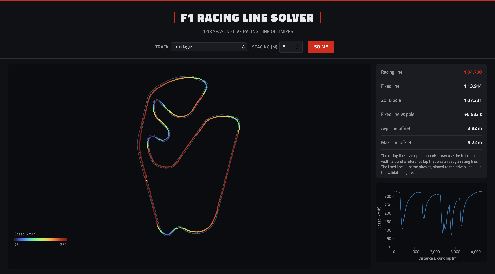

# f1-lap-sim

A physics-based Formula 1 lap time simulator. A Rust minimum-time optimal-control solver
finds the fastest way around a circuit — the full velocity profile, and optionally the
fastest line within the track's real width — from real track geometry and measured track
boundaries.



Validated against every race of the 2018 season: pinned to the line a driver actually drove,
the solver lands **+5.5% off real qualifying pole times** across all 21 circuits.

## Two modes, and why the difference matters

| mode | solves for | vs. real 2018 poles |
|---|---|---|
| `optimal` | the speed profile, pinned to the driven lap | **+5.5%** — the validated number |
| `racingline` | the speed profile *and* the line, within the track width | **−10.0%** — an upper bound |

`racingline` is the more complete model: it contains the fixed-line case exactly (a zero
lateral offset), so it can never solve slower, and that identity is used as a built-in
correctness check. But it currently reads faster than any real lap, because its extra
freedom is under-constrained — a point mass changes direction for free, and the grip limit
is only enforced at the solver's sample points. **Read its lap time as "no faster than
this", not as a prediction.**

`optimal` is the narrower model, and it is the one to trust: everything it needs was
measured rather than assumed.

## Quick start

Requires Rust and `ipopt`. The setup script assumes **macOS with Homebrew** — on Linux the
build works too, but you'll need to install ipopt through your package manager and point
`PKG_CONFIG_PATH` at it yourself rather than running the script.

```
brew install ipopt
./scripts/setup_ipopt.sh      # one-time; works around ipopt-sys's coin/ header path
cargo build --release
```

Running a solve prints a stray debug line to stderr —
`[.../ipopt-0.6.0/src/lib.rs:410:9] data.mult_g = 0x...`. That is a `dbg!` left in the
upstream `ipopt` crate, not this project; it is harmless and stdout is unaffected. Append
`2>/dev/null` if it bothers you.

Track data is not in the repo (see [Data](#data)), so export a circuit first:

```
python3 -m venv .venv && source .venv/bin/activate
pip install -r requirements.txt

python python_scripts/export_track.py --track Suzuka --lap-number 2
python python_scripts/export_tum_boundaries.py --track suzuka
python python_scripts/derive_downforce.py --track suzuka
```

Then solve it:

```
cargo run --release -- suzuka
```

## CLI

```
cargo run --release -- <track> [mode] [spacing]
```

- **`<track>`** — track slug (`monaco`, `suzuka`, `singapore`, …), matching the `<slug>_`
  prefix under `data/`. Default: `singapore`.
- **`[mode]`** — `racingline` (default) or `optimal`. See the table above.
- **`[spacing]`** — collocation-point spacing in metres. Default: `5.0`. Lap time is still
  converging above that — 25 m reads 1–2 s optimistic because widely spaced samples skip
  curvature peaks, while 5 m is within ~0.1 s of a full 1 m solve. Coarser is faster but
  flattering; finer costs time without changing the answer.

```
cargo run --release -- monaco                     # racing line, 5 m spacing
cargo run --release -- suzuka optimal 5           # fixed-line baseline
cargo run --release -- redbullring racingline 25  # coarser, faster, optimistic
```

Printed to stdout: point counts, curvature stats, the solved lap time, and in `racingline`
mode the lateral offset used and the delta against the fixed-line baseline.

Written to `data/`: `<slug>_racingline_path.csv` (X/Y line, boundaries and speed, read by
`plot_racing_line.py`), plus `<slug>_curvature_debug.csv` and `<slug>_simulated_lap_*.csv`
as debug output. Nothing in the repo reads those last two — they exist for inspecting a
solve by hand. The curvature profile is what to look at first when a lap time looks wrong,
since it is the input the whole solve rests on.

## Web UI

The same solver, live in the browser — pick a track, hit Solve, explore the line and speed
trace. Not a replay of precomputed data; it runs the same `solve_racing_line` pipeline as
the CLI.

```
cargo run --release --bin web
```

Then open `http://127.0.0.1:3000`. The track selector lists every circuit that has a
boundaries file, and warns on the ones whose track width is assumed rather than measured.

## How it works

Minimum-time optimal control over the whole lap at once, by direct collocation, solved with
Ipopt using hand-derived analytic Jacobians and Hessians (checked against Ipopt's own
finite-difference checker). The formulation is curvilinear and heading-based, following
Perantoni & Limebeer, on a staggered grid that removes a checkerboard null space
structurally rather than penalising it.

The model includes a friction ellipse (braking and cornering share one grip budget),
per-circuit downforce and drag derived from each track's own telemetry, DRS only where the
real car had it open, the MGU-K's 4 MJ-per-lap energy budget as a control the solver places,
and a steering-rate limit taken from the real lap. All 21 circuits converge in about a
second.

The repo is split in two:

- **Rust** (`src/`) — the simulator: track-curve fitting, the collocation solver, lap-time
  integration, and the web server. This is the part that matters.
- **Python** (`python_scripts/`) — a thin, one-time data-export layer that pulls real
  telemetry and track geometry to CSV.

## Data

`data/` is gitignored, so a fresh clone has no track data and you export what you need. The
one exception is `<slug>_aero_params.csv`, which **is** tracked: two derived numbers per
circuit that the physics depends on, and a missing one silently costs ~16% of lap time.

| File | Produced by | Needed for |
|---|---|---|
| `<slug>_track_geometry.csv` | `export_track.py` | both modes |
| `<slug>_reference_lap.csv` | `export_track.py` | steering-rate limit, `derive_downforce.py` |
| `<slug>_track_boundaries.csv` | `export_tum_boundaries.py`, or `export_osm_boundaries.py` for the 4 circuits it doesn't cover | `racingline` mode |
| `<slug>_drs_zones.csv` | `export_track.py` | DRS (falls back to DRS-closed) |
| `<slug>_aero_params.csv` | `derive_downforce.py` | per-circuit aero (warns and falls back to a coarse default) |

The scripts, each with a fuller docstring at the top of its file:

- **`export_track.py`** — pulls a real FastF1 lap (default: 2018 Q, HAM) and exports
  centreline geometry, the reference speed trace and DRS zones. `--lap-number` matters: the
  fastest lap isn't always the cleanest telemetry.
- **`export_tum_boundaries.py`** — the preferred boundary source. Downloads the TUM
  racetrack-database's satellite-measured track widths and registers them against the driven
  line by ICP. Covers 17 of the 21 circuits, caches to `cache/`, and is deterministic.
- **`export_osm_boundaries.py`** — fallback for Baku, Monaco, Paul Ricard and Singapore.
  OpenStreetMap carries no track widths, so width is imputed from `lanes` tags where they
  exist and otherwise assumed.
- **`derive_downforce.py`** — derives `c_l` and `c_d` per circuit from that track's own
  telemetry (apex lateral acceleration, top speed) rather than a coarse classification.
- **`validate_pole_times.py`** — runs the solver against real 2018 pole times across all 21
  circuits. Appends every run to `results/validation_log.csv` so runs can be compared
  per-track later.
- **`check_solver.py`** — the regression suite, and the thing to run after changing the
  solver: pinned-width invariants, convergence on every circuit, and a diff against a saved
  run. Exits non-zero if something broke. There are no `cargo test` unit tests yet — correctness
  is currently checked end-to-end through this script and `validate_pole_times.py`; proper
  Rust-side tests and CI are planned.
- **`plot_racing_line.py`** — plots a solved line against the boundaries, coloured by speed.

<details>
<summary>Per-circuit export recipes for a full rebuild</summary>

For the 17 circuits in the TUM database the command takes no per-track arguments —
`export_tum_boundaries.py --track <slug>` for each of bahrain, catalunya, cota, hockenheim,
hungaroring, interlagos, melbourne, mexico, montreal, monza, redbullring, shanghai,
silverstone, sochi, spa, suzuka, yasmarina.

Only four circuits need the OSM path and its per-track search strings. OSM renames things, so
treat these as starting points; the script fails loudly rather than producing something
wrong, and `--inspect-tags` is the quickest way to confirm a name resolves.

| slug | arguments |
|---|---|
| baku | `--relation-name "Baku City Circuit"` |
| monaco | `--relation-name "Circuit de Monaco"` |
| paulricard | `--relation-name "Paul Ricard"` |
| singapore | `--relation-name "Marina Bay"` |

If the default Overpass instance refuses connections, pass
`--overpass-url https://overpass.kumi.systems/api/interpreter`.

For `export_track.py` only three lap numbers were recorded — `Monza --lap-number 2`,
`Singapore --lap-number 3`, `Suzuka --lap-number 2` — and the rest used the default fastest
lap. Check the endpoint gap it prints. The output slug is `--track` lowercased, so
multi-word circuits must have been passed as a single token to produce slugs like
`paulricard`; the exact strings weren't recorded. Every circuit also needs
`derive_downforce.py --track <slug>` afterwards.

</details>

## Accuracy and limitations

The fixed-line result is +5.5% against real poles, and the honest reading is that most of
what remains is one coefficient. `c_l` is estimated from a median over 10–25 apex samples
and alone explains about half the cross-circuit variance in the gap; the worst circuit,
Sochi, sits at +17.6%. Fixing that estimator is the next real piece of work.

Not modelled:

- **The car is a point mass** — no yaw inertia, weight transfer or tyre slip angles. Worth
  under a second of lap time, but it is why a freely chosen line finds time a real car
  couldn't.
- **A sub-grid artifact** — give the car 1 cm of lateral freedom and it still finds 0.3–1.1 s
  by weaving, because the grip limit is enforced only at sample points.
- **No harvesting** — the MGU-K's 4 MJ is granted rather than earned under braking, and can
  be spent anywhere on the lap.
- **No tyre wear, fuel burn, track evolution, elevation or banking.** Reasonable for a single
  qualifying lap, less so for anything else.
- **Four circuits have no measured track width** (Baku, Monaco, Paul Ricard, Singapore), so
  their racing lines are the least trustworthy here.
- **Everything rests on one lap per circuit**, and it isn't quite the lap being scored
  against: geometry comes from Hamilton's lap, while the benchmark is the fastest lap by any
  driver.

**[`results/DISCUSSION.md`](results/DISCUSSION.md) is the real story** — the full engineering
narrative from V1 to V9: what was tried, what was rejected and why, the formulation errors
that were found and fixed, and how the accuracy actually evolved. Including the conclusions
that turned out to be wrong.

## Licence

MIT — see [LICENSE](LICENSE). The data this project reads is separately licensed; see
Acknowledgements. None of it is redistributed here (`data/` and `cache/` are gitignored).

## Acknowledgements

- **[FastF1](https://github.com/theOehrly/Fast-F1)** — timing, telemetry and track position
  for the 2018 season.
- **[TUMFTM/racetrack-database](https://github.com/TUMFTM/racetrack-database)** (LGPL-3.0),
  from the Chair of Automotive Technology at the Technical University of Munich — the
  centrelines and satellite-measured track widths that 17 of the 21 circuits here depend on.
  Contact person: Alexander Heilmeier. The image-processing algorithm that extracted the
  widths from satellite imagery was developed by Andressa de Paula Suiti during her semester
  thesis at the same chair. This project only downloads from that repository; nothing is
  contributed back and none of its data is redistributed here.
- **OpenStreetMap** contributors (ODbL) — track-edge geometry for the circuits the TUM
  database doesn't cover.
- Formulation after Perantoni & Limebeer, *Optimal Control for a Formula One Car with
  Variable Parameters* (2014).
