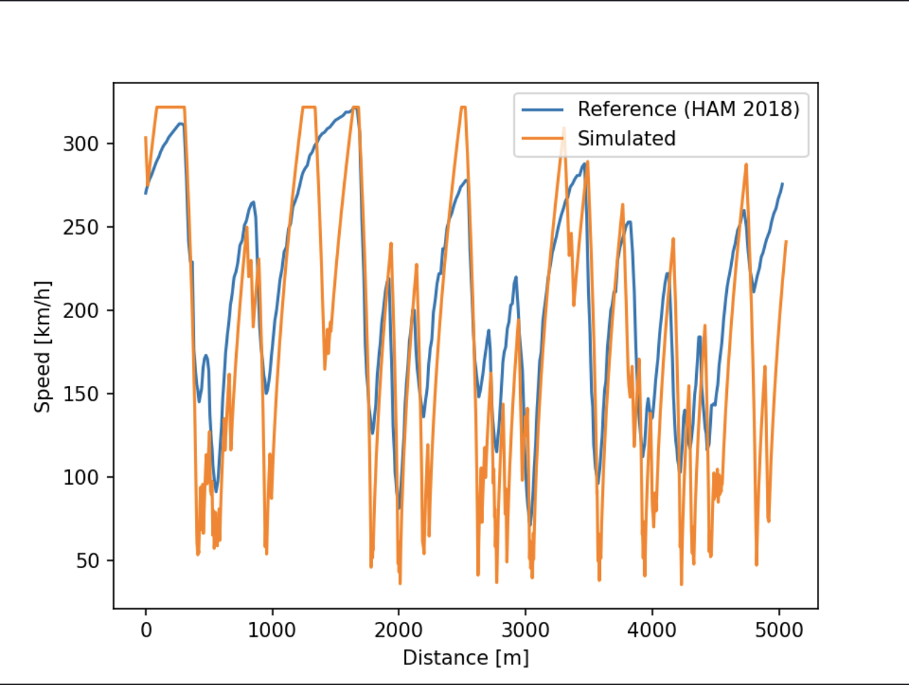
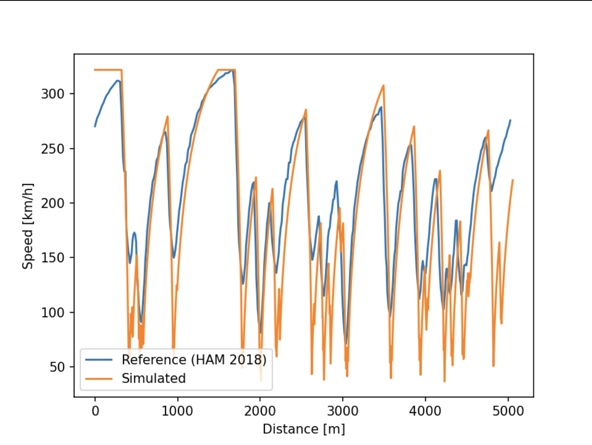
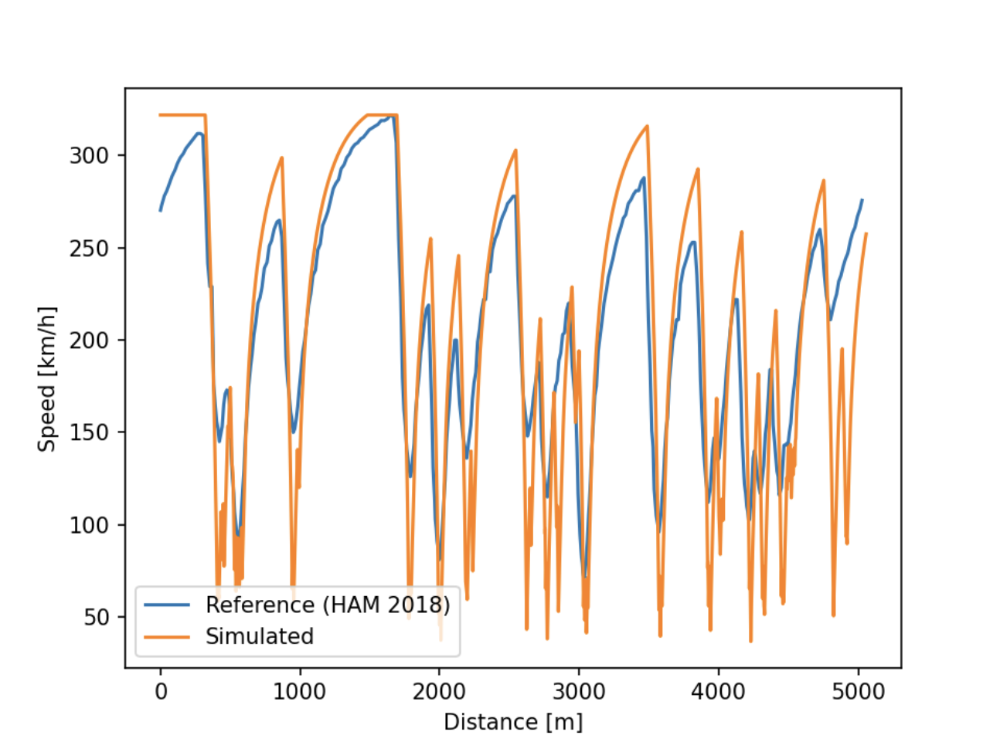
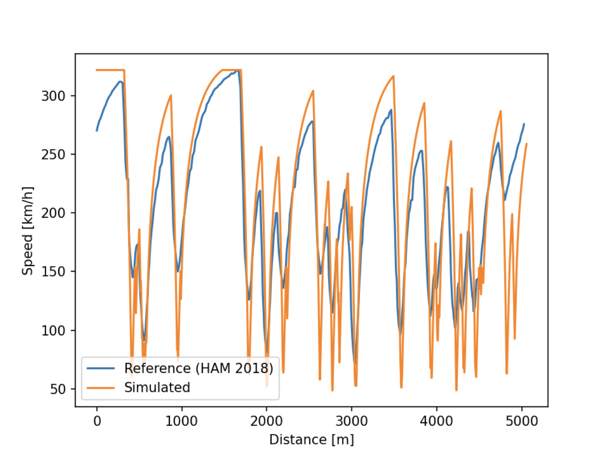
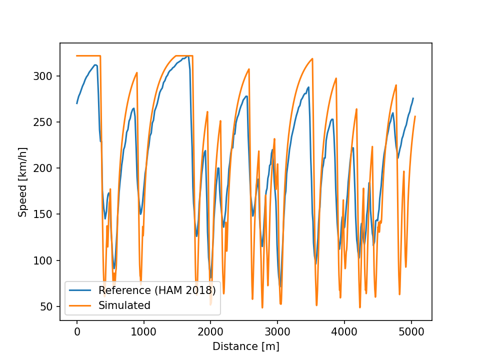
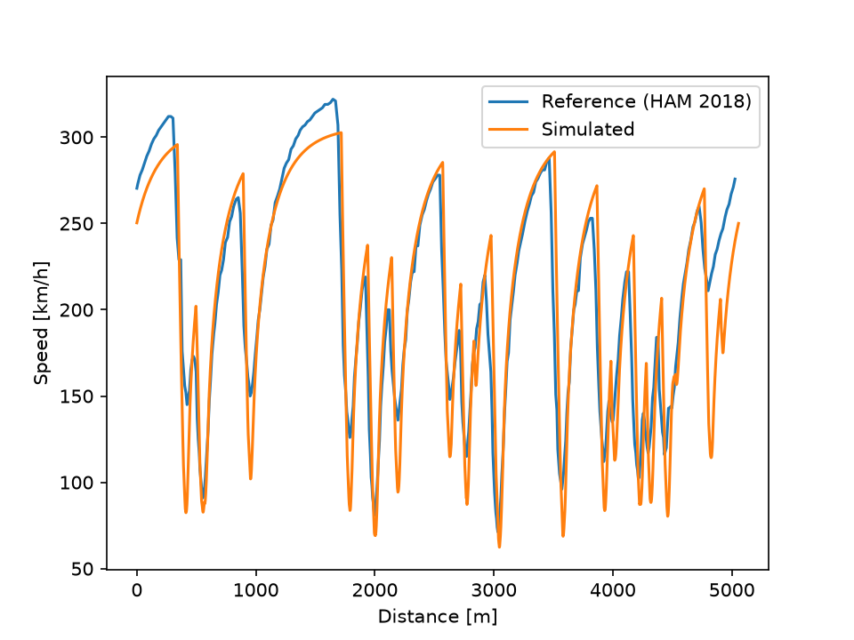
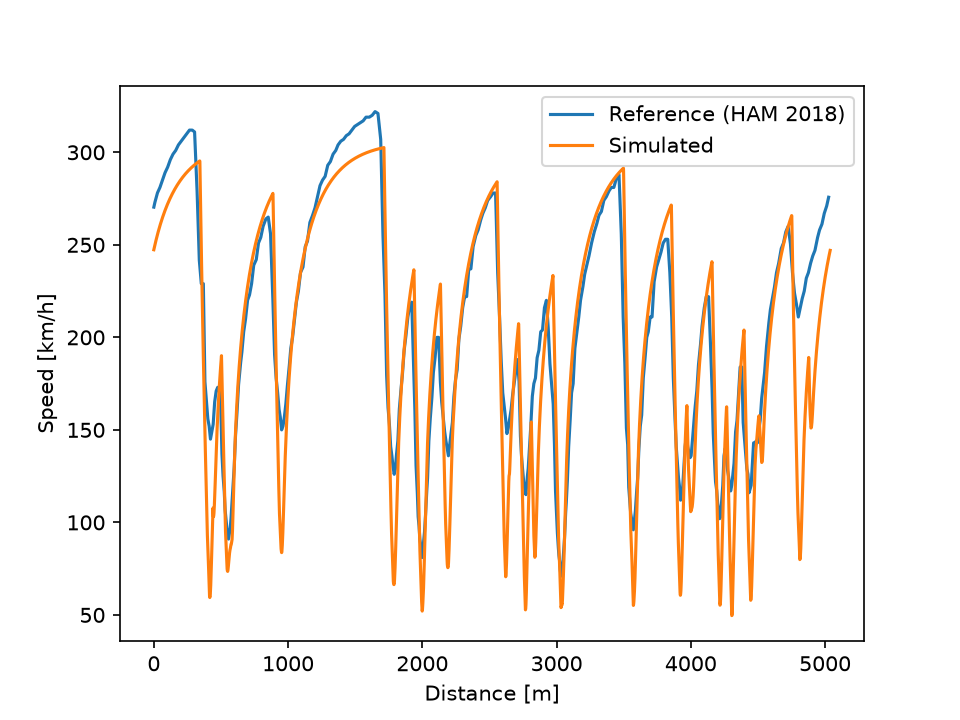
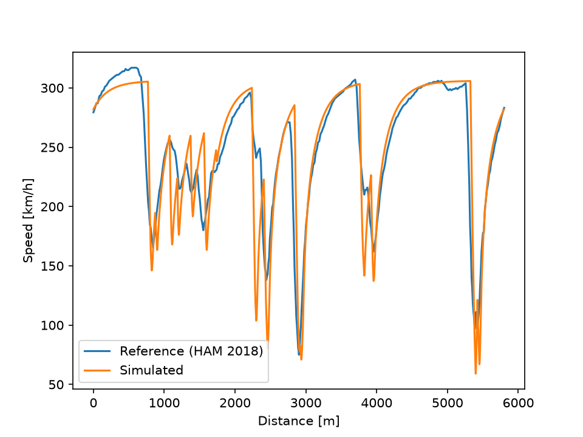
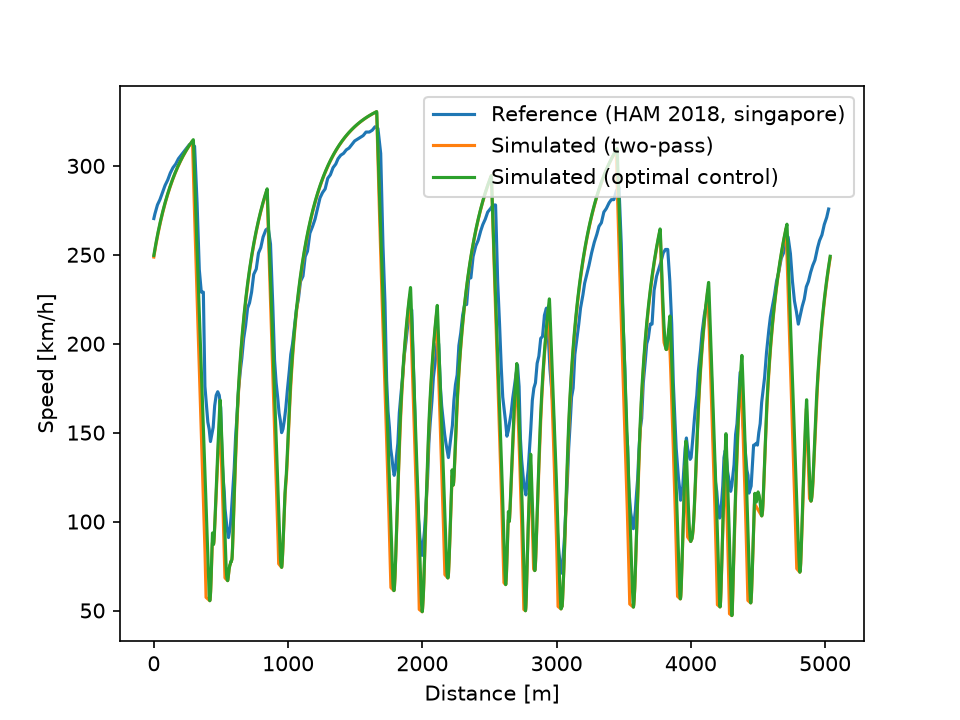

# Validation: Simulated vs Reference Lap

**Reference**: Lewis Hamilton, Singapore GP 2018 Qualifying, pole lap (1:36.015)
**Simulator**: point-mass model, periodic cubic spline track, two-pass velocity solver

---

## Model progression (v1)

The simulator was developed iteratively. Each stage added a physical component and reduced the lap time error.

| Model | Lap time | Delta | Error |
|---|---|---|---|
| Reference (HAM 2018 Q) | 1:36.015 | — | — |
| Baseline (friction circle only) | 2:06.834 | +30.8 s | +32% |
| + Aero (c_l = 0.004) | 2:02.728 | +26.7 s | +28% |
| + Aero (c_l = 0.008) | 1:58.004 | +22.0 s | +23% |
| + Power curve + curvature smoothing | 1:42.969 | +6.95 s | +7% |

---

## Stage 1 — Baseline: friction circle only

Corner speed limit: `v_max = sqrt(μ_lat · g / κ)` with `μ_lat = 1.5`, no aero, flat `a_max = 15 m/s²`.



The macro-level track structure is reproduced correctly — speed peaks and valleys appear at the right distances throughout the lap. The dominant failure is corner minimum speeds: the simulator drops to 35–50 km/h where the reference stays at 90–150 km/h. On the straights, both traces reach the same top speed (~322 km/h), as `v_top` is calibrated directly from the reference lap. The 32% lap time error is almost entirely explained by corners being too slow.

---

## Stage 2 — Aerodynamic downforce and drag (c_l = 0.004)

Downforce increases the effective normal force: `N = mg + c_l·v²`, raising the corner speed limit to `v_max = sqrt(μ_lat·g / (κ − μ_lat·c_l))`. Drag reduces available acceleration: `a_net = a_available − c_d·v²`.



With `c_l = 0.004`, the improvement is modest (~4 seconds). At low corner speeds (10–15 m/s), the downforce contribution `c_l·v²` is small relative to `g`, so the corner speed limit barely changes. The aero effect is speed-dependent — it only matters significantly in medium- and high-speed corners.

---

## Stage 3 — Increased downforce (c_l = 0.008)

Singapore is one of the highest-downforce circuits on the calendar. Doubling `c_l` to 0.008 gives a more realistic representation of the 2018 car's aerodynamic package.



Corner exits in the first half of the lap (0–2000 m) now track the reference closely. The second half remains worse — the technical section around 2500–4000 m has many closely-spaced corners where combined braking and cornering (not captured by our independent-axis model) is the limiting factor.

---

## Stage 4 — Power curve and curvature smoothing (final model)

The forward pass now uses a traction-limited and power-limited acceleration model:

```
a_traction  = μ_lon · (g + c_l·v²)
a_power     = P_specific / v
a_available = min(a_traction, a_power) − c_d·v²
```

This replaces the flat `a_max` cap. The key gain is that traction couples with downforce — at 100 km/h, effective traction is `μ_lon·(g + c_l·v²) ≈ 24 m/s²` vs the previous flat 15 m/s². Power limits only kick in near top speed (~300 km/h).

Curvature smoothing (10 m moving average) reduces narrow spikes from GPS noise in the input centerline data.



Corner exit acceleration now closely matches the reference across most of the lap. The remaining divergence is concentrated in the second half (2500–5000 m), which is the friction ellipse gap — combined braking and cornering reduce available grip in both axes simultaneously, which the independent-axis model cannot capture.

---

## Remaining sources of divergence

### Friction ellipse coupling

The model treats lateral and longitudinal grip as fully independent. In reality, the friction ellipse constraint means braking while cornering (turn-in) and accelerating while cornering (exit) reduce available grip in both directions. Implementing this would require coupling `μ_lat` and `μ_lon` through an ellipse constraint, changing corner speed limits and the two-pass propagation simultaneously.

### Curvature noise

Some speed dips in the simulated trace are not real corners but curvature spikes from GPS noise in the track centerline. The current post-hoc smoothing (10 m moving average on curvature) reduces but does not eliminate them. The correct fix is a smoothing spline fit to the raw GPS geometry, which does not enforce exact interpolation through every noisy point. This was attempted during development but the interpolating spline used here amplifies rather than suppresses geometry noise when the input points are moved, so curvature smoothing remains a known approximation.

### Tire degradation

Not modelled. On a qualifying lap (fresh tires, maximum grip), this is a negligible effect — qualifying is the most appropriate lap to simulate with a constant-grip model.

---

## Conclusion (v1)

The final v1 model (1:42.969) is within 7 seconds of the reference pole lap (1:36.015), a 7% error, using only mechanical grip, a simplified aero model, and a power curve. The track structure is reproduced correctly throughout. The primary remaining gap is the friction ellipse, which would require a more coupled solver. The model is a sound foundation for sensitivity analysis: lap time response to changes in `c_l`, `μ_lat`, or `P_specific` can be read directly from a parameter sweep.

---

---

# V2 — Friction Ellipse

## What changed

The two-pass solver now couples lateral and longitudinal grip through the friction ellipse constraint:

**(a_lat / μ_lat·g_eff)² + (a_lon / μ_lon·g_eff)² ≤ 1**

At each point, the lateral load already carried (`a_lat = v²·|κ|`) reduces the remaining longitudinal budget:

```
a_lon = μ_lon · g_eff · √(1 − (a_lat / μ_lat·g_eff)²)
```

This affects both passes: forward pass (acceleration out of corners) and backward pass (braking into corners). `a_brake` is retained as a flat soft floor (`a_brake × 0.3`), representing that real tire friction ellipses are not perfectly sharp — some longitudinal capacity remains even at high lateral load, regardless of how saturated the lateral grip is.

## Results

| Model | Lap time | Delta | Error |
|---|---|---|---|
| Reference (HAM 2018 Q) | 1:36.015 | — | — |
| V1 final (independent axes) | 1:42.969 | +6.95 s | +7% |
| V2 (friction ellipse) | 1:47.671 | +11.7 s | +12% |



## Discussion

The friction ellipse increases the lap time by ~5 seconds relative to v1. This is physically correct: the v1 model allowed full braking while cornering and full acceleration while cornering, which overstated performance in the combined-load zones (turn-in and exit). The ellipse correctly penalises those zones.

The reference lap (1:36) is driven by Hamilton, who optimally uses the friction ellipse — trail braking into corners, blending lateral and longitudinal grip continuously through the corner. The two-pass algorithm cannot replicate this: it assumes a discrete sequence of brake → corner → accelerate. A skilled driver effectively "extends" the friction budget by never being fully at the lateral or longitudinal limit exclusively.

The remaining 12% error therefore has two components:
1. **Physics gap** — parameters and model structure (same issues as v1: curvature noise, no tire model)
2. **Algorithmic gap** — the two-pass cannot recover the time a real driver gains by optimally blending lat/lon grip across the full corner arc; this requires an optimal control formulation (minimum-time problem) rather than a greedy two-pass sweep

The algorithmic gap is fundamental to the two-pass approach and cannot be closed without replacing the solver.

---

# V3 — Recalibration and Periodic Boundary Fix

## What changed: geometry and parameter fixes

Three fixes were made on top of V2:

1. **Removed the interpolating B-spline geometry smoother** that had briefly been introduced to address the curvature-noise problem described above. As already noted in that section, an *interpolating* spline amplifies rather than suppresses noise when input points are perturbed — this was confirmed in practice and reverted. Curvature smoothing remains the simpler post-hoc moving average.
2. **Restored the correct track length.** A bug in the arc-length/resampling path had been producing an incorrect total track length; fixing it brings the resampled length to 5057 m, close to FastF1's own reported lap distance (5026 m, ~0.6% higher — plausibly a geometric-path-length vs. telemetry-distance discrepancy).
3. **Recalibrated car parameters**, including reducing `p_engine` from 1200 to 921 W/kg — the latter corresponds to a real hybrid power unit's specific power (~735 kW combined ICE+MGU-K over ~800 kg race weight), rather than an arbitrary round number.

## Results after recalibration

| Model | Lap time | Delta | Error |
|---|---|---|---|
| Reference (HAM 2018 Q) | 1:36.015 | — | — |
| V2 (friction ellipse) | 1:47.671 | +11.7 s | +12% |
| V3 recalibrated | 1:39.476 | +3.46 s | +3.6% |

The corner-by-corner shape now tracks the reference closely across nearly the entire lap, not just the aggregate lap time — confirmed by plotting the simulated and reference speed traces against distance rather than relying on the total-time figure alone.

## Periodic boundary fix (start/finish line)

Plotting the recalibrated trace revealed one clear artifact: the first ~300 m sat flat at `v_top` (322 km/h) while the reference lap is still accelerating out of the final corner before the line, from ~270 km/h.

**Root cause:** the track model (`track.rs`) is periodic — the spline and curvature array represent a closed loop — but the velocity solver (`solver.rs`) is not. `backward_pass` only ever sets `v[i]` from `v[i+1]`, and `forward_pass` only ever sets `v[i]` from `v[i-1]`; neither touches the boundary between the last sample and the first. So index 0 had no upstream constraint from the corner that actually precedes it on the real track (which is off the end of the array), and was left at the bare corner-speed limit computed from local curvature alone. No amount of outer-loop iteration could fix this, since the connection between the last and first sample simply doesn't exist in an open sweep — it isn't a convergence problem, it's a missing constraint.

**Fix:** `main.rs` now concatenates the curvature array with itself three times (`curvature.iter().cycle().take(n * laps)`) and runs the existing, unmodified two-pass solver over the padded array. By the third copy, the artificial cold-start transient from the very first sample has been overwritten — pass after pass — by the real upstream braking constraint carried over from the previous copy. Only the final lap (`v[(laps-1)*n .. laps*n]`) is kept for lap-time integration and CSV export. A periodicity check (max difference between the final lap and the one before it) printed exactly `0`, confirming the solution has converged to a genuinely periodic steady state and that 3 laps was more than sufficient padding (a single extra lap was already enough in principle, given the artifact only extended ~260 m — consistent with the deceleration distance from `v_top` into the first braking zone).

## Results after the boundary fix

| Model | Lap time | Delta | Error |
|---|---|---|---|
| Reference (HAM 2018 Q) | 1:36.015 | — | — |
| V3 recalibrated (open boundary) | 1:39.476 | +3.46 s | +3.6% |
| V3 final (periodic boundary) | 1:40.060 | +4.05 s | +4.2% |



## Discussion

The periodic fix makes the lap time *worse* (+0.58 s) but more honest: the previous 3.6% figure was partly inflated by a solver artifact that let the car begin the lap already at top speed, for free, rather than carrying speed over realistically from the corner before the line. This is the correct trade — a result that looks better only because of a boundary bug is not a result worth keeping.

At 4.2% error, this remains the best-validated model so far, and the remaining gap is consistent with what V1 and V2 already identified: curvature noise from the moving-average smoother, and the algorithmic gap between the two-pass sweep and a real driver's continuous blending of lateral and longitudinal grip through the friction ellipse (see V2 discussion above). Both remain open items rather than newly discovered issues.

---

# V4 — Removing the Top-Speed Leak, and a Generalization Test on Suzuka

## Top speed was leaking the answer

`v_top` (the hard speed cap used in `corner_speed_limits`) was being read directly from `reference_lap.csv` — Hamilton's own recorded peak speed. The model wasn't predicting top speed, it was copying it from the lap it was being validated against. Replaced with a value derived from the car's own power/drag balance: at top speed, `a_available = P_specific/v − c_d·v² = 0`, so `v_top = ∛(P_specific/c_d)`. This gives 306.0 km/h from the existing `p_engine`/`c_d` values, versus the leaked 322 km/h.

Lap time barely moved (1:40.060 → 1:40.049, still 4.2% error): the simulated trace was already power/drag-limited to ~303–305 km/h on the longest straight before ever reaching the old cap, so the leak turned out not to be load-bearing — but it no longer needs to be trusted not to be.

## Generalization test: does this hold on a second track?

Every result so far was for one track (Singapore) and one driver (Hamilton), with parameters (`μ_lat`, `μ_lon`, `c_l`, `c_d`, `p_engine`) explicitly tuned against that one lap (see V3: "recalibrated parameters"). A 4.2% error under those conditions doesn't distinguish "the model is accurate" from "the model was fit to this lap." The cheapest way to tell the difference: run the same fixed parameters, unretouched, against a second, independent track — Suzuka, HAM, 2018 Q, chosen for being structurally different from Singapore (fast and flowing vs. a slow, technical street circuit).

The first attempt looked nothing like a validation result — the simulated and reference traces looked like two unrelated laps, RMS speed error ~84 km/h. That turned out to be three compounding bugs, not one:

1. **Curvature noise.** The interpolating cubic spline through raw GPS points amplifies noise into curvature — one point spiked to κ=0.72 (a 1.4 m corner radius, impossible for a racetrack). Mild enough at Singapore's point density to go unnoticed; severe at Suzuka. Fixed by replacing the interpolating spline with a periodic penalized-regression B-spline (`fit_periodic_bspline` in `track.rs`): far fewer control points than raw samples (one roughly every 12 m), so the fitted curve is structurally incapable of reproducing point-to-point noise, with a periodic roughness penalty so the start/finish line doesn't reintroduce the seam problem V3 already fixed once for the velocity solver.
2. **Distance-axis mismatch.** The pipeline built its own arc-length axis from Euclidean chord length between consecutive raw X/Y points. At high speed, position samples can go stale between GPS fixes, so this systematically undercounts true distance — 11% short on Suzuka (non-uniformly, up to 650 m of local error), negligible on the slower Singapore. Fixed by using FastF1's own `Distance` channel (integrated from `Speed`, not resampled position) as the arc-length parameter instead, exported alongside X/Y in `track_geometry.csv`.
3. **A corrupted lap.** `pick_fastest()` had silently picked a Suzuka lap (lap 8) with a genuine ~630 m gap between its first and last position samples — a real telemetry dropout, invisible from lap time alone, and not caught by FastF1's own `IsAccurate` flag (sector-time-based, not position-based). Fixed by checking a candidate lap's endpoint gap before trusting it, and adding an explicit `LAP_NUMBER` override in `export_track.py` (lap 2, 0.94 s slower than the corrupted "fastest" lap, clean 1.2 m endpoint gap).

None of these were specific to Suzuka — Singapore simply wasn't fast or corrupted enough to expose them.

## Results

| Track | Lap time | Reference | Error | RMS speed error | Mean signed bias |
|---|---|---|---|---|---|
| Singapore (HAM, pole) | 1:47.854 | 1:36.015 | +12.3% | 30.3 km/h | −7.8 km/h (consistent) |
| Suzuka (HAM, lap 2) | 1:30.614 | 1:28.702 | +2.2% | 27.9 km/h | +1.0 km/h (~unbiased) |




## Discussion

This is not the result I'd have predicted, and that's exactly why the test was worth running rather than assumed. Singapore's error *increased* substantially (4.2% → 12.3%) once the geometry pipeline became honest, while Suzuka — a track the parameters were never fit to — comes out more accurate (2.2%) and with almost no systematic bias.

The likely explanation: `μ_lat = 1.63`, `c_l = 0.008`, and the rest were tuned in V3 against Singapore's *old*, bugged geometry (over-smoothed curvature from the moving-average filter, a track length 0.6% off). That tuning absorbed and compensated for the old pipeline's specific errors. Once the geometry became more accurate, the compensation no longer matches — Singapore's fit degrades because the thing it was fit to no longer exists, while Suzuka, never having been curve-fit at all, shows what the parameters actually predict on genuinely independent data.

Two things support reading this as a parameter-fit problem rather than a remaining data or geometry bug: Singapore's error is a *consistent* −7.8 km/h bias (the signature of a systematic model/parameter mismatch) rather than the large, localized swings that characterized the three Suzuka bugs above; and Suzuka's near-zero mean bias with comparable RMS suggests the residual there is closer to unstructured noise than to a systematic gap.

Net conclusion: the model generalizes structurally (both tracks now show plausible, explicable error, not the "unrelated laps" failure mode from before), but the specific parameter values do not — they were a Singapore-specific fit, not physically derived constants. Re-deriving `μ_lat`/`μ_lon`/`c_l`/`c_d` from something other than "whatever matches one lap" is the natural next step, not further geometry work.

---

---

# V5 — Physically-Derived Parameters and a Minimum-Time Optimal-Control Solver

## Re-deriving the parameters from 2018 regulations and public aero data

Every parameter (`μ_lat`, `μ_lon`, `c_l`, `c_d`, `p_engine`) was, up to V4, a curve-fit to Hamilton's Singapore lap — useful for a single-track validation, but not something that means anything physically, and V4 already showed the fit was absorbing Singapore-specific geometry bugs rather than reflecting the car. Replaced with values derived from public 2018 figures instead of any lap time:

- **Mass**: 734 kg, the 2018 minimum combined car+driver weight, appropriate for a near-empty-fuel qualifying lap.
- **`μ_lat` = 1.6, `μ_lon` = 1.55**: published tire-only (aero-excluded) friction estimates for F1 slicks (~1.4–1.8 lateral, ~1.5–1.6 longitudinal). Notably close to the old curve-fit values (1.63 / 1.5) — a reasonable cross-check, not a coincidence to lean on.
- **`p_engine` = 1015 W/kg**: (625 kW ICE + 120 kW MGU-K peak) / 734 kg. This is a known idealization — the MGU-K's energy store limits deployment to ~33 s/lap, not continuously, and this model has no energy-budget state to represent that (see "Why not model the energy budget now" below).
- **`c_l`/`c_d`**: unlike the other parameters, these are real per-circuit choices — teams change wing level by track, so a single "universal" figure can't represent both a high-downforce circuit and a low-downforce one correctly. Derived from two historical reference points (Monaco, max downforce, Cd≈1.08, Cl/Cd≈2.89; Monza, min downforce, Cd≈0.68, Cl/Cd≈2.98) which show the L/D ratio staying roughly constant (~2.9) across downforce levels while the absolute Cd scales with wing level. Three tiers (high/medium/low), applied to all 21 tracks on the 2018 calendar by circuit character:

  | Tier | Cd / Cl | c_d / c_l (m⁻¹) | Tracks |
  |---|---|---|---|
  | High | 1.05 / 3.05 | 0.0012 / 0.0036 | Monaco, Hungaroring, Singapore, Catalunya |
  | Medium | 0.85 / 2.47 | 0.0010 / 0.0029 | Melbourne, Bahrain, Shanghai, Paul Ricard, Silverstone, Hockenheim, Sochi, Suzuka, COTA, Mexico*, Interlagos, Yas Marina |
  | Low | 0.70 / 2.03 | 0.00082 / 0.0024 | Baku, Montreal, Red Bull Ring, Spa, Monza |

  (*Mexico is folded into "medium" as an approximation — its real air density at 2240 m altitude is ~77% of sea level, an effect this model doesn't separate from the wing-level choice.)

`main.rs` also gained multi-track support alongside this: `export_track.py` and `main.rs` now take a track slug and read/write `data/<slug>_*.csv`, so multiple tracks' data can coexist rather than each run overwriting the last (`scripts/setup_ipopt.sh` and `.cargo/config.toml` were added later in this stage for an unrelated reason — see below).

## First result: both test tracks get worse, and by a similar amount

| Track | Lap time | Reference | Error |
|---|---|---|---|
| Singapore | 1:58.163 | 1:36.015 | +23.1% |
| Suzuka | 1:45.646 | 1:28.702 | +19.1% |

Both plots showed the same shape of error: correct timing/location of every peak and valley, but the simulated trace overshoots every peak (top speed 344–353 km/h vs. real 317–322) and undershoots every valley (tightest corners 50–70 km/h vs. real 90–150). Same root cause twice: `c_d` too low for real drag, `c_l` too low for real downforce — because the initial pass used one universal "calendar-average" Cl/Cd for every track, and Singapore and Suzuka are both above-average-downforce circuits. Splitting into the three tiers above (Monza got its own low-downforce entry too, once real Monza data was pulled as a third test point) recovered most of the gap:

| Track | Tier | Lap time | Reference | Error |
|---|---|---|---|---|
| Singapore | high | 1:55.344 | 1:36.015 | +20.1% |
| Suzuka | medium | 1:43.587 | 1:28.702 | +16.8% |
| Monza | low | 1:27.367 | 1:21.321 | +7.4% |

Error still scales with how corner-heavy the track is (Monza, mostly flat-out, is least sensitive to any remaining aero mismatch), which is expected and not itself a bug — see the braking-floor discovery below for where much of the remaining gap actually was.

## A minimum-time optimal-control solver, replacing the two-pass sweep

The two-pass sweep (`backward_pass`/`forward_pass`) is bang-bang: at every point it brakes or accelerates at the absolute edge of the friction ellipse, with no notion of a driver choosing to hold back briefly to carry more speed through a corner (real trail braking). Closing this gap — flagged as the single biggest remaining lift back in the original roadmap — means replacing the greedy sweep with an actual minimum-time optimal control problem solved over the whole lap at once, via [Ipopt](https://coin-or.github.io/Ipopt/) through the `ipopt-rs` crate (`src/optimal.rs`).

**Formulation.** State `x(s) = v(s)²` (avoids a `1/v` singularity and makes the dynamics affine in the control), control `u(s) = a_lon(s)`. The racing line is still fixed, so lateral acceleration is pinned by whatever `v` the solver picks (`a_lat = x·κ`), not a free choice — the only real decision is how hard to brake or accelerate. Trapezoidal collocation over `n` points around the closed (periodic) lap:

```
x[i+1] - x[i] - (u[i] + u[i+1])·ds = 0                          (dynamics defect)
(x·κ)² / (μ_lat·g_eff)² + u² / (μ_lon·g_eff)² ≤ 1               (friction ellipse)
u ≤ p_engine/√x - c_d·x                                         (power ceiling)
minimize Σ ds/v[i]                                              (lap time)
```

No separate braking-capacity constraint — see below for why.

**Getting `ipopt-rs` building at all.** `ipopt-sys`'s vendored CMake build searches for headers under `coin/`, a layout COIN-OR replaced with `coin-or/` (which is what Homebrew ships) some time after this binding was last updated for a new Ipopt version — no env var exists to override the search path directly. Fixed with a small, reproducible local shim rather than patching Homebrew's own directory: `scripts/setup_ipopt.sh` generates a `coin` symlink and a `.pc` file pointing pkg-config at it, and `.cargo/config.toml` points `PKG_CONFIG_PATH` at it using a repo-relative path — works for any dev via `brew install ipopt && ./scripts/setup_ipopt.sh`.

**L-BFGS doesn't scale to full resolution.** The first working version used Ipopt's limited-memory (L-BFGS) Hessian approximation rather than hand-derived second derivatives — a reasonable corner-cut, but one with a real ceiling. Bisecting resolution against problem size:

| Grid spacing | Variables | Result |
|---|---|---|
| 25 m | 404 | converged, 131 iterations |
| 15 m | 672 | converged, 700 iterations |
| 10 m | 1008 | converged, 1713 iterations |
| 7 m | 1440 | **failed** — hit 3000-iteration cap, `inf_pr` oscillating rather than shrinking |
| 1 m (full) | 10078 | **failed** — same oscillating-not-converging pattern |

Iteration count grew much faster than linearly with problem size before failing outright — the known signature of L-BFGS's fixed-size memory window capturing proportionally less curvature information as dimension grows. Fixed by deriving the analytic Hessian instead (the dynamics defect is linear and contributes nothing; only the objective and the ellipse/power constraints need second derivatives — worked out in the `optimal.rs` module comment). Full 1 m resolution then converged in 43 iterations, 0.7 s.

## The old braking floor was a two-pass crutch, not real physics

The first full-resolution comparison came out backwards: optimal control was *slower* than the two-pass (116.359 s vs. 115.344 s on Singapore), which shouldn't be possible if the two-pass's bang-bang solution is a feasible point inside the optimal solver's constraint set. It wasn't. `backward_pass` had carried a floor since V2 —

```rust
let a_brake_eff = (a_lon.max(params.a_brake * 0.3) + params.c_d * v[i+1].powi(2)).max(0.0);
```

— guaranteeing at least `a_brake × 0.3` (13.5 m/s²) of braking capacity even when the pure ellipse implies near zero, which happens exactly at high lateral load, i.e. exactly where trail braking matters. The two-pass sweep had been quietly exceeding the friction ellipse in corner-entry zones the whole time; V2's justification (real friction ellipses aren't perfectly sharp) doesn't hold up once there's an algorithm capable of blending honestly instead of needing a patch. Dropped from both solvers — `CarParams` no longer has an `a_brake` field at all — for one consistent, honestly-enforced ellipse everywhere.

## Results: two-pass vs. optimal control, same physics, same resolution

| Track | Reference | Two-pass | Optimal | Two-pass error | Optimal error | Optimal vs. two-pass |
|---|---|---|---|---|---|---|
| Singapore | 1:36.015 | 2:06.833 | 1:56.359 | +32.1% | +21.2% | −10.47 s (−8.3%) |
| Suzuka | 1:28.702 | 1:51.396 | 1:44.270 | +25.6% | +17.6% | −7.13 s (−6.4%) |
| Monza | 1:21.321 | 1:31.914 | 1:28.032 | +13.0% | +8.3% | −4.22 s (−4.2%) |

The optimal-control gain scales with how corner-heavy the track is — Singapore (most corners, most lateral-load time) gains the most, Monza (mostly flat-out) the least — consistent with the mechanism: on Singapore, optimal control is faster at 98.5% of points by a modest, broadly-distributed +7.1 km/h on average (not a few dramatic corners), which is why the two traces look nearly identical on a speed-vs-distance plot despite the 8.3% aggregate gap. The margin the old floor used to paper over was spread almost everywhere the car was near the lateral limit, and that's the same margin real blending recovers.



All three traces track the same peaks and valleys at the same distances — the two-pass and optimal-control lines are visually almost indistinguishable from each other, both following the reference shape closely. That similarity is the point: the 8.3% gap between two-pass and optimal isn't visible as a shape difference because it isn't one, it's the small, broadly-distributed per-point margin described above, not a difference in *where* the car brakes or accelerates.

Error-vs-reference is still large (13–32% for two-pass, 8–21% for optimal) now that the floor is gone — expected, not a new problem. Two known idealizations account for most of it: the sharp (rather than rounded) friction ellipse, and `p_engine` as a continuously-available peak figure with no ERS energy budget, both already flagged as open items rather than newly discovered here.

## Why not model the energy budget now

Raised and deliberately deferred: the MGU-K's 4 MJ/lap budget isn't a pointwise constraint like everything else in this model — how much boost is available at a given point depends on how much has already been spent everywhere earlier in the lap, and *where* to spend a fixed budget for maximum benefit is itself an optimization problem, not a physics inequality. It's the same class of problem as the optimal-control work just done, not a separate one: modeling it properly means adding an energy state to the collocation formulation above (a running "MJ spent so far" variable threaded through the solve) rather than a standalone heuristic, which would just be trading one hand-tuned rule for a smaller one. Natural next extension of `optimal.rs`, not a new solver.

---

---

# V6 — A Free Racing Line, Real Track Boundaries, and Closing the Aero Gap

## From a fixed line to a free racing line

V5's `MinTimeProblem` pins the car to the FastF1 driven centerline — only speed is free, lateral acceleration is whatever `a_lat = x·κ_ref` the chosen speed implies. Real drivers use track width to straighten corners (wide entry → apex at the inside → wide exit), raising the effective corner radius and letting them carry more speed — that's the actual "racing line," and it was entirely absent from the model. This was the original motivation for pulling in real track-width data at all.

Three formulations were considered for how a free lateral offset `n(s)` should feed into path curvature:
- **Zeroth-order** (`κ_path ≈ κ_ref/(1−n·κ_ref)`, ignoring how `n` *changes*): rejected — misses the entry-apex-exit S-shape that's the actual source of a racing line's speed gain, which comes from how `n` changes across a corner, not just being offset at a point.
- **Full second-order Frenet formula** (needs `n''`, a 3-point stencil): rejected — breaks the 2-point trapezoidal coupling the whole `optimal.rs` module is built around.
- **Heading-based curvilinear formulation** (chosen): adds heading angle `ξ(s)` as a state and makes path curvature `κ(s)` itself a free control, replacing the fixed `κ_ref` array `MinTimeProblem` uses directly. This is the standard formulation in minimum-time lap-sim literature (Perantoni & Limebeer). It avoids `n''` entirely — `ξ` absorbs that role — while keeping the same 2-point-per-segment coupling pattern.

With `h(s) = 1 − n(s)·κ_ref(s)` (path-length stretch factor) and the small-angle approximation `tan ξ ≈ ξ`, `cos ξ ≈ 1` (valid for realistic racing-line heading deviations; `ξ` gets a loose ±0.3 rad bound as a numerical safety rail, not a physical limit):

```
dn/ds = h·ξ
dξ/ds = κ·h − κ_ref
dt/ds = h/v                         (replaces MinTimeProblem's implicit 1/v)
a_lat = v²·κ = x·κ                  (κ now free, was the fixed curvature array)
```

`RacingLineProblem` extends `MinTimeProblem`'s `[x(n), u(n)]` to `[x(n), u(n), n(n), ξ(n), κ(n)]` (5n variables) and `[x-defect, ellipse, power]` to `[x-defect, n-defect, ξ-defect, ellipse, power]` (5n constraints), with `n` bounded by track width and everything warm-started from `n=0, ξ=0, κ=κ_ref` — which exactly reproduces `MinTimeProblem`, so the solver always starts from a known-feasible point. `n=0` being a feasible point of the more general problem gives a free, built-in correctness check for every run: racing-line lap time must be ≤ the fixed-line optimal time, since the fixed line is a special case of the more general one.

**A numerical artifact, caught by that same check.** The first working version came out *faster* than the fixed-line baseline by ~1.4 s with track width pinned to ~0 — impossible, since `n=0` forces `κ=κ_ref` exactly in the continuous problem. Root cause: the `ξ`/`κ` chain has an exact null-space direction — an alternating `ξ_i=+A, ξ_{i+1}=−A` pattern has a trapezoidal segment-average of exactly zero regardless of `A`, satisfying the `n`-defect equation for free at any amplitude while still letting `κ` deviate from `κ_ref` favorably in the ellipse constraint. Fixed with a regularization term penalizing the *point-to-point difference* `Σ(ξ_i−ξ_{i+1})²` (not raw magnitude — an earlier attempt at that required a weight large enough to also crush genuine racing-line curvature, which produced multi-thousand-second "lap times"). `κ` needed its own, separately-calibrated regularization weight for the same checkerboard mode one level down, since it has more direct leverage on the ellipse constraint than `ξ` does. Both weights were calibrated against a regression check — pinning `n_left`/`n_right` to ~0 and confirming the racing-line solver reproduces `MinTimeProblem`'s lap time to within ordinary discretization error (~0.5 s at 25 m spacing, ~0.1 s at 10 m).

## Real track boundaries from OpenStreetMap

Track width needs a real source, and the obvious first guess — the 2nd–98th percentile spread of where drivers actually drove across one qualifying session — measures driver-line convergence, not physical track width (professional drivers converge on nearly identical lines lap after lap; checked on Singapore, this gave an average "width" of 12.5 cm). Replaced with OpenStreetMap's road geometry, via `python_scripts/export_osm_boundaries.py`, which represents the actual paved surface: a `type=circuit` relation's constituent ways (preferred, carries `lanes` tags for a per-point width estimate) or a `highway=raceway` bbox query (fallback of last resort for a circuit with no relation — no width tags, one constant fallback width, and materially riskier since a permanent circuit's grounds can contain unrelated raceways sharing the same tagging). OSM's lat/lon geometry is registered against FastF1's local X/Y frame via ICP (brute-force initial rotation search, then iterated closest-point + Kabsch rigid-transform refinement), with mean registration residual as the primary data-quality signal (~5–10 m is a genuine racing-line-vs-road-centerline gap; north of ~15–20 m is a warning sign of a bad relation match, not real geometry).

**Two shapes of nearest-point matching error, needing two different detectors** (`despike_offset`): the raw pipeline finds, for each reference-line point, the nearest point on the registered OSM road centerline — a pure 2D spatial search, blind to track topology, which fails in two ways:
1. **Sharp snap-to-wrong-lobe** — a run of samples jumps onto a stable but wrong offset plateau, bounded by sharp single-sample jumps in and out. Suzuka's crossover (the track physically passes over/under itself) and Shanghai's tightly nested corners both produce this. Caught by detecting plateaus via their boundary jumps, then keeping only the ones whose mean is actually far from the track-wide median — magnitude alone missed plateaus straddling any single cutoff (Suzuka: one at −16 m, the next at +15 m).
2. **Gradual multi-way drift** — found on Singapore, where the nearest match wanders through a nearby paddock/pit-access road, climbing smoothly to an 88 m offset over ~180 m and back, with no single jump large enough to trip the first detector. Caught by hysteresis thresholding (as in Canny edge detection): a point beyond a high threshold seeds a bad region, which floods outward through neighbors while they stay above a looser low threshold — bounding the region at where the drift actually returns to baseline rather than at a fixed magnitude.

Both masks are OR'd together and the flagged points linearly interpolated from surrounding good samples. Thresholds were tuned into the gap between two observed clusters: Baku's genuine narrow "castle section" chicane (real jumps up to ~13.5 m) and Monaco's genuine registration noise (up to ~16.4 m deviation, no sharp jumps) on one side, Suzuka/Shanghai's wrong-lobe snaps (16–95 m) and Singapore's drift (14–88 m) on the other. That global compromise wasn't tight enough everywhere, though: Red Bull Ring and Yas Marina both had real leftover artifacts sitting *under* the shared defaults but clearly separated from each track's own deviation percentiles — fixed with CLI-exposed per-track threshold overrides instead of one more global compromise attempt.

**Singapore's remaining infeasibility — a model limit, not a data bug.** After the drift fix, Singapore still reported infeasible. First hypothesis — a fourth failure mode, an OSM lane-tag width glitch — didn't survive inspection of the raw samples: the flagged jump (`center_offset` −5.5→+8.3 over 7.5 m) *holds* and decays smoothly over the next ~170 m, the opposite of a nearest-point mismatch's signature (which snaps in and back out sharply). That's a real corner, not bad data — confirmed by testing a finer 10 m solver grid instead of touching the data at all, which still didn't produce a trustworthy solve (Ipopt reported success with the racing line *slower* than the fixed line, impossible since `n=0` is always feasible). The real corner's offset changes faster than the solver's steering-rate assumption (`ξ_bound`, or the small-angle approximation itself) can represent — left as a known limitation rather than despiking away genuine track geometry to force a fix.

## Extending to the full 2018 calendar

Of the 21-race 2018 calendar, **15 tracks now run end-to-end** through the racing-line solver (verified both numerically — `SolveSucceeded` with lap time ≤ the fixed-line baseline — and visually against known track shapes): Monaco, Baku, Suzuka, Shanghai, Monza, Spa, Montreal, Paul Ricard, Silverstone, Hockenheim, Hungaroring, COTA, Interlagos, Red Bull Ring, Yas Marina.

**6 known limitations, none pursued further:**

| Track(s)    | Issue | 
|---|---|
| Bahrain, Catalunya | OSM relation bundles multiple real track layouts (e.g. car vs. motorcycle circuit); registration residual 35–63 m, unusable |
| Sochi, Mexico | No OSM relation found at all — an OSM data-availability gap, not a fixable code issue |
| Singapore | Real corner geometry exceeds the solver's steering-rate/small-angle model limit (see above) |

## Validating against real pole times: a systematic gap

With the racing-line solver working across 15 tracks, the natural check is against something the model was never fit to: each track's real 2018 qualifying pole time (fetched live via FastF1, not hardcoded). Result: a **systematic +16.3% mean gap** (stdev 3.7%) across all 15 tracks — and not noise. The gap tracked how corner-heavy each track is: straight-line-dominated tracks (Baku, Monza) were closest (~+10%); fast-flowing, corner-heavy tracks (Silverstone, COTA, Hockenheim, Suzuka, Yas Marina) were worst (+19–22%). That pattern points at underestimated *cornering* grip, not power or drag.

**`μ_lat` alone doesn't close it.** Pushing `μ_lat` from 1.6 to 1.8 (the top of its published "tire-only" range) closed only part of the gap, unevenly — e.g. Hungaroring +15.9%→+10.5%, COTA +22.0%→+16.7% — confirming `μ_lat` matters but isn't the dominant lever.

**DRS closes a small, real slice.** Modeled as a per-point drag reduction (`c_d_drs`, 12% lower than `c_d`, applied only where `python_scripts/export_track.py`'s exported `DRS` telemetry channel shows the flap open on the same lap — DRS never affects cornering, since it closes before the braking zone). This only touches the power-ceiling constraint's first derivatives in `optimal.rs` (no Hessian changes needed) and required sizing the solver's velocity upper bound off the DRS-*open* top speed so a zone's real speed potential isn't clipped. Measured gain: 0.05–0.34 s/lap (mean 0.24 s) — moved the mean gap from +16.3% to +16.0%, exactly the "a small slice, not the bulk" estimate made before implementing it.

**The 3-tier downforce classification was the real problem.** `python_scripts/derive_downforce.py` derives `c_l` and `c_d` per track from that track's own real telemetry instead of guessing which of 3 buckets a circuit belongs to: `c_d` from the real observed top speed (power/drag balance, assuming DRS open there), `c_l` from real apex lateral acceleration at "quasi-steady-state cornering" points — every point where `|dv/ds|` falls in the bottom quartile for that lap, not just single local-speed-minimum points (an earlier attempt using only exact minima starved several tracks of samples entirely, including two with zero). Both signals are independent of lap time itself, so validating the result against real lap times isn't circular curve-fitting.

| track | solver | real pole | gap |
|---|---|---|---|
| baku | 93.761 | 101.498 | −7.6% |
| redbullring | 59.855 | 63.130 | −5.2% |
| suzuka | 85.685 | 87.760 | −2.4% |
| hungaroring | 75.856 | 76.666 | −1.1% |
| cota | 91.920 | 92.237 | −0.3% |
| shanghai | 90.997 | 91.095 | −0.1% |
| hockenheim | 71.207 | 71.212 | −0.0% |
| spa | 102.258 | 101.501 | +0.7% |
| paulricard | 91.503 | 90.029 | +1.6% |
| monza | 80.814 | 79.119 | +2.1% |
| monaco | 72.907 | 70.810 | +3.0% |
| yasmarina | 98.761 | 94.794 | +4.2% |
| montreal | 73.979 | 70.764 | +4.5% |
| silverstone | 91.408 | 85.892 | +6.4% |
| interlagos | 72.272 | 67.281 | +7.4% |

**Mean gap: +0.9%, stdev 4.1%** — down from +16.3%/3.7%, i.e. the derivation closed the gap broadly rather than just relocating it (stdev roughly unchanged). A few tracks (Baku, Red Bull Ring) come out slightly *faster* than the real pole, which is philosophically sane for a theoretical optimum being compared against one human driver's single best lap, not necessarily a sign of over-fitting. Reproducible via `python_scripts/validate_pole_times.py`, committed as a permanent check rather than left as a one-off.

## Why `μ_lat` still isn't derived per track

The natural next question: if `c_l` can be derived per track from apex data, why not `μ_lat` too? At a single apex point, `a_lat = μ_lat·(G + c_l·v²)` is one equation in two unknowns — `μ_lat` has to be fixed to solve for `c_l` at all. But that equation *is* linear in `v²` (intercept `μ_lat·G`, slope `μ_lat·c_l`), so in principle one regression of every qualifying apex's `a_lat` against `v²` should identify both jointly. Tried it, rejected it: widening the apex speed floor to give the regression a useful `v²` range let through points that aren't real corners at all — a flat-out straight also has `|dv/ds|≈0`, so a tiny residual curvature (GPS noise, a gentle kink) at very high speed passed the curvature filter (a "274 km/h apex" at Yas Marina). Those sit far out in `v²`, giving them outsized leverage on an ordinary-least-squares fit and wildly distorting the intercept extrapolated back to `v=0` — derived `μ_lat` came out 2.1–6.3 across tracks (vs. the published 1.4–1.8) with R² as low as 0.04 on most tracks, and two tracks failed outright (a non-physical negative slope on one, too few points on another). The existing median-based `c_l` estimate tolerates the same stray points fine — a median just ignores a few outliers, exactly where a regression's intercept is most exposed to them. `μ_lat` stays fixed at 1.6.

## Solver consolidation

By this point three distinct algorithms existed and overlapped: the original two-pass bang-bang sweep (V1–V3), `MinTimeProblem`'s fixed-line optimal control (V5), and `RacingLineProblem`'s free-lateral-offset optimal control (this stage) — the latter a strict superset of the one before it (pinning `n≈0` reproduces `MinTimeProblem`'s lap time almost exactly, per the regression check above). The two-pass sweep added nothing `MinTimeProblem` didn't already do better, so it was dropped entirely from `main.rs`'s CLI — `racingline` is now the default mode, with `optimal` (`MinTimeProblem`) kept only as the fallback for a track with no boundary data and as `racingline`'s own built-in correctness-check baseline. `backward_pass`/`forward_pass` (the two-pass sweep's core) stay in `solver.rs` regardless — both Ipopt problems still use them internally to build a warm-start guess.

## Remaining open items

- The ~1% residual mean gap and ~4% stdev are consistent with ordinary per-lap noise (a single real driver's one best lap vs. a theoretical per-track optimum) rather than a further systematic model error to chase.
- No tire degradation, fuel-load burn-off, or track-evolution modeling — reasonable for a single qualifying lap (fresh tires, near-empty fuel), same idealization flagged since V1.
- No ERS energy-budget state (V5's deferred item) — still open, same reasoning as before.
- The 6 tracks outside the working set (above) are accepted limitations, not active problems.

---

---

# V7 — Auditing the Solver: Three Formulation Errors, a Regularization That Never Worked, and the Limit of a Point Mass

Not a new feature: a full correctness pass over the repo (code, docs, physics), triggered by
nothing more than "check whether this is right". It found three real errors in the
optimal-control formulation, a numerical artifact the V6 regularization was pricing rather
than removing, and — after the fixes — the uncomfortable result that V6's headline +0.9%
agreement had been two errors cancelling.

## Three formulation errors, and one silent failure mode

**Drag wasn't counted in the grip limit.** `u` is the car's *net* longitudinal acceleration
— the dynamics (`dx/ds = 2u`) and the power ceiling (`u ≤ p_engine/√x − c_d·x`) both require
that reading. But the friction ellipse used `u` directly as the tire's longitudinal force,
when the tires actually supply `u + c_d·x`. Under braking, drag decelerates the car for
free, and the solver wasn't crediting it: at 300 km/h that's ~7 m/s² unaccounted for against
~48 m/s² of tire grip, i.e. braking understated by ~14% at the start of a high-speed braking
zone. The two-pass warm start (`backward_pass`) had always had this right, so the two
solvers had been running subtly different physics. Fixing it moved fixed-line lap times by
−0.05 to −0.21 s on most tracks (a couple went slightly the other way, since the
acceleration side gets *tighter* by the same term).

**The racing line's speed equation integrated over the wrong distance.** `RacingLineProblem`
inherited `x[i+1] − x[i] = ds·(u_i + u_{i+1})` unchanged from `MinTimeProblem`, but the
collocation grid steps along the *reference* line while the car covers `h·ds` of its own
path per step. The lap-time integrand already carried that `h`; the speed equation didn't,
so on the inside of a corner the car banked the speed change of a full step while being
charged the time of a shorter one. Worth +0.02 to +0.33 s once corrected — second-order, as
expected, but free to fix.

**Every lap was modelled slightly too long.** `coarsen` took every k-th point of the 1 m
array, which leaves the wrap-around segment back to the start shorter than the rest while
the periodic collocation still treats it as a full `ds`. Measured at 25 m spacing: +22 m on
Red Bull Ring, ~+20 m on Monaco, Silverstone, Shanghai and Monza — about 0.3 s, the same
size as several entries in V6's validation table. Replaced with an exactly uniform periodic
grid (`m = round(L/target)` points spaced `L/m`).

**A non-converged solve was reported as a result.** Ipopt's status was printed and then
ignored, so `InfeasibleProblemDetected` still returned numbers: Bahrain's unusable boundary
data produced a confident 2:34 lap. Both solvers now return `Err`.

All Jacobian and Hessian entries were re-derived and checked against Ipopt's own
`derivative_test` at several perturbation sizes — the remaining flagged entries shrink as
the step grows (rounding noise), and the one that persists scales linearly with it
(one-sided finite-difference truncation), which is what a *correct* analytic derivative
looks like.

## The checkerboard artifact was priced, not removed

V6 added `XI_REG_WEIGHT`/`KAPPA_REG_WEIGHT` to suppress an alternating ξ/κ null-space mode,
and validated the fix by pinning track width to ~0 and checking that the racing line
reproduces `MinTimeProblem`. That check passed — because pinning `n` to *exactly* zero also
removes the freedom the artifact needs. Pin the width to ±1 cm instead, which cannot buy
more than a few hundredths of a second of real lap time, and the racing line came out
**0.8–1.2 s faster** than the fixed line. The regularization had made the mode expensive,
not impossible, and its cost scales with grid spacing, so finer grids leaked more, not less.

Dumping the solution confirmed the mechanism exactly: κ alternating ±0.01 around κ_ref from
one point to the next, lowered at the speed-limiting nodes (Monaco's hairpin, κ 0.094 →
0.084) and raised where grip was spare.

The cure is structural rather than another weight. ξ now lives on the *segments* between
collocation points instead of on the points themselves (a staggered grid, the same trick
that kills odd-even decoupling in CFD):

```
n-defect[i]  = n[i+1] - n[i] - ds*xi[i]*(h[i] + h[i+1])/2
xi-defect[i] = xi[i] - xi[i-1] - ds*(kappa[i]*h[i] - kappa_ref[i])
```

ξ is then fixed by n's first differences and κ by ξ's, so with the width pinned there is no
alternating pattern left to find. Every constraint still couples only neighbouring points,
which was V6's stated reason for rejecting the second-order Frenet formulation. **Both
regularization weights, and the calibration they needed, are gone.**

Verification, at 25 m: with width pinned to exactly zero the racing line now equals the
fixed line to **0.000 s** on Monaco, Monza and Suzuka (previously 0.535 / 0.028 / 0.046);
with ±1 cm the gap is **0.035–0.081 s**, down from 0.757–1.637 s.

## What the artifact was hiding: the corridor

With the wiggle gone, the solver started using the lateral freedom it had actually been
given — and that turned out to be nonsense. On Monaco it reached **19.8 m** from the
reference line, on a track about 12 m wide, because `n_left`/`n_right` carry the ICP
registration error (up to ~16 m there, already noted in V6) straight into the corridor. Two
physical constraints now apply when the boundaries are loaded: the car's own half width
(1.0 m) comes off each side, and since a driven lap was by definition on the track, an
offset that would put the driven line outside the usable width is registration error and
gets clamped back to just touching the edge. Monaco's maximum offset drops to 5.0 m and laps
slow by 0.6–2.8 s.

## The +0.9% was two errors cancelling

| track | racing line | fixed line | real pole | fixed vs pole | racing vs pole |
|---|---|---|---|---|---|
| baku | 84.711 | 94.208 | 101.498 | −7.2% | −16.5% |
| redbullring | 54.094 | 59.940 | 63.130 | −5.1% | −14.3% |
| hungaroring | 66.060 | 76.343 | 76.666 | −0.4% | −13.8% |
| shanghai | 84.968 | 90.758 | 91.095 | −0.4% | −6.7% |
| suzuka | 78.052 | 88.007 | 87.760 | +0.3% | −11.1% |
| hockenheim | 66.027 | 72.163 | 71.212 | +1.3% | −7.3% |
| cota | 83.780 | 93.633 | 92.237 | +1.5% | −9.2% |
| paulricard | 82.526 | 91.867 | 90.029 | +2.0% | −8.3% |
| spa | 95.936 | 104.061 | 101.501 | +2.5% | −5.5% |
| monza | 74.974 | 82.312 | 79.119 | +4.0% | −5.2% |
| monaco | 66.355 | 74.980 | 70.810 | +5.9% | −6.3% |
| yasmarina | 91.619 | 100.467 | 94.794 | +6.0% | −3.3% |
| montreal | 70.658 | 75.781 | 70.764 | +7.1% | −0.1% |
| interlagos | 66.701 | 72.677 | 67.281 | +8.0% | −0.9% |
| silverstone | 81.458 | 93.085 | 85.892 | +8.4% | −5.2% |

**Fixed line: +2.5% mean (stdev 4.3%). Racing line: −7.4% mean (stdev 4.7%)** at the 25 m
spacing that was the default when this was measured. At the 5 m default adopted below, the
same 15 tracks read **+3.8%** and **−8.5%** respectively.

The fixed-line number is credible — a theoretical optimum on a real driver's own line,
landing a couple of percent slow, with the residual spread explainable by per-track aero and
telemetry quality. The racing-line number is not: it claims a lap 5–12 s (roughly 10%)
faster than the fixed line, i.e. that Hamilton left 10% on the table *on his own racing
line*, with at most 2.5 m of lateral room either side of it. V6's +0.9% agreement was this
same over-performance held in check by the regularization that was quietly suppressing the
lateral freedom altogether.

## Five explanations for the remaining gap, and why each is wrong

Each was tested rather than argued, and each is recorded here mostly so it isn't retried:

- **Corridor too wide.** Widening it to a 12 m track (the FIA Grade 1 minimum) makes the
  racing line *faster* still, −7.6% → −11.5%, about 1 s per extra metre. Not the cause —
  though it did reveal that every track is running the `DEFAULT_LANES × LANE_WIDTH_M`
  fallback of 7 m, because essentially no OSM way carries a `lanes` tag. The widths in
  `*_track_boundaries.csv` are a default, not data.
- **Registration error.** Checked directly: on Suzuka, Silverstone, Spa and Interlagos the
  driven-line-to-road-centre offset stays within ±2 m and never leaves the track. Monaco
  (6.2% of samples) and Baku (13.0%) are localized spikes, not drift — their 5th–95th
  percentiles are as tight as anyone's. A better global registration would change little.
- **Grid spacing.** Old and new coarsening converge to the same lap time at 1 m, confirming
  the uniform-grid fix. But 25 m reads 1-2 s optimistic versus converged, almost always
  fast, because widely spaced samples skip curvature peaks; 5 m is within ~0.1 s and costs
  under a second. **The default was therefore changed from 25 m to 5 m** -- which makes the
  headline numbers *worse* (fixed line +2.5% -> +3.8%, racing line -7.4% -> -8.5%), since
  the coarse grid had been flattering both. That is the correct direction: a lap time that
  looks better because the grid is too coarse to see the corners is not a better lap time.
  Two consequences worth knowing: the results table above was measured at 25 m and so reads
  about a second fast, and the pinned-width artifact below *grows* on finer grids (Suzuka
  0.08 s at 25 m, 1.08 s at 5 m) -- with 1 cm of width the solver can still find ~1 s, so
  some residual grid-scale exploit survives the staggered formulation. Smaller than the gap
  being chased here, but the next numerical thing to look at.
- **Geometry smoothing.** The 12 m / λ=1 spline fit was suspected of over-smoothing corners
  (an apparent 30–60% under-statement of corner curvature). That suspicion was wrong: it
  compared against a Savitzky-Golay estimate from raw telemetry that is itself
  noise-inflated. Judged properly — fit the even-numbered raw samples and the odd-numbered
  ones separately and compare the two curvature profiles — the current settings sit at 2–4%
  split-half disagreement with sensible minimum radii (Suzuka 13.8 m, Silverstone 18.3 m),
  and corner curvature barely moves across the whole stable range. **A warning worth
  keeping:** ordinary cross-validation on held-out *positions* prefers 6 m knots with λ=0.1,
  which predicts positions twice as accurately and produces curvature implying 0.3 m radius
  corners, making Silverstone and Spa infeasible. Position fit and second-derivative quality
  are not the same objective.
- **Curvature rate (the point-mass "flick").** A point mass can change path curvature
  instantly; a real car must build yaw and steering angle first, so its curvature rate is
  bounded in *time*, not distance: `|dkappa/ds| <= omega_max/v`. Measured, the free line was
  using |dkappa/dt| of ~0.30 1/(m·s) at the 95th percentile on Suzuka where the real car
  managed 0.04 — 7x, and above the real car's recorded maximum. That looked like the answer.
  It isn't: capping it at the rate the real car demonstrably achieved (99th percentile of
  the reference lap's own |dkappa/dt|, measured on the solver's grid) pulls the line's
  curvature rate down by 3x, to exactly the limit — and moves lap time by 0.0-0.97 s. The
  freedom to flick was worth about a tenth of a second, not ten.

  The constraint was **kept anyway**, because it costs almost nothing and the racing line's
  *shape* is an output in its own right: the line it now draws is one a car could actually
  steer. It applies to both problems — on `MinTimeProblem`, where kappa is fixed, it reduces
  to a per-point speed cap, and it has to be applied there too or `n=0` stops being feasible
  for the racing-line problem and the "racing line can never be slower" invariant breaks. It
  costs a little accuracy on the validated fixed-line number (+2.3% -> +2.5% against pole
  times), which is the honest price of a limit the real lap only satisfies to the 99th
  percentile.

## The residual pinned-width artifact: a sub-grid wiggle, not a solver bug

The staggered grid removed the odd-even null space, but the pinned-width check (width forced
to ±1 cm, where the racing line can gain essentially nothing real) still finds time, and
*more* of it as the grid refines — the opposite of what a discretization error does:

| grid | racing | fixed | artifact | if it scaled as 1/ds² |
|---|---|---|---|---|
| 25 m | 87.926 | 88.007 | 0.081 s | 0.081 s |
| 10 m | 87.404 | 87.849 | 0.445 s | 0.506 s |
| 5 m | 86.973 | 88.050 | 1.077 s | 2.025 s |
| 2 m | 86.834 | 88.514 | 1.680 s | 12.66 s |

(Suzuka.) The mechanism, from dumping the solution: the curvature deviation is almost
entirely checkerboard (0.00029 of 0.00033 rms at 5 m), worth up to **8.9 m/s² of lateral
acceleration** — a fifth of the grip budget — bought with a 1 cm zigzag in `n`. The reason
it grows on finer grids is that a wiggle's curvature goes as `n/ds²`, so with the amplitude
fixed at 1 cm, halving `ds` quadruples the curvature the solver can dial in. The growth is
sub-quadratic in practice because the steering-rate limit clips part of it.

Two things make that profitable, and neither is a coding error:

1. **The friction ellipse is enforced only at collocation points.** The solver puts the
   low-curvature phase of the wiggle exactly on the node where the constraint binds (an
   apex) and the high-curvature phase on neighbours that had slack. Evaluated at segment
   midpoints, the solution does exceed the limit — but only mildly (max 1.022, 3% of
   midpoints), so denser constraint enforcement would recover part of this, not all.
2. **A point mass has no cost for high-frequency steering.** A 1 cm zigzag at a 10 m
   wavelength is a real path a car could trace geometrically (its curvature amplitude
   implies ~0.3° of steering angle), and nothing in this model charges for putting the
   steering in and taking it out again — no yaw inertia, no tire relaxation, no unsprung
   response. This is the *same* root cause as the racing line's overall over-performance,
   arriving through a different door.

So this is not a separate numerical defect to be chased with another reformulation; the
honest reading is that it is the point-mass assumption showing up at grid scale. It does
have a practical consequence worth stating plainly: **at the 5 m default the racing line
carries roughly a second of this artifact**, on top of everything else that makes it an
upper bound. The fixed line is unaffected (its curvature is fixed, so there is no wiggle to
find), which is the mode the validation number belongs to.

## Where that leaves it

By elimination the remaining gap is the vehicle model itself — and specifically *not* the
one part of it that looked most suspicious, since the steering-rate test above ruled out
instantaneous direction change as the mechanism. **A point mass pays nothing to
reposition laterally beyond satisfying the grip limit pointwise** — no yaw inertia, no load
transfer, no slip angle, no steering dynamics. On a fixed line that costs little, since the
path's curvature came from a real car in the first place, and `c_l` is derived from that
same lap's apex data, so the grip model is calibrated to reproduce exactly that case. Free
the path and the calibration no longer constrains anything: lateral freedom becomes
available at a price no real car pays. Perantoni & Limebeer, whose curvilinear formulation
this follows, pair it with a full vehicle model for precisely this reason.

So the honest reading of the current state:

- **`optimal` (fixed line) is the validated model**, at +2.3% against real pole times.
- **`racingline` is an upper bound** on what line choice alone could buy under a point-mass
  car — directionally useful, not a lap-time prediction, and currently the CLI default and
  the only mode the web UI runs.

The natural next step is a single-track (bicycle) model with yaw dynamics — new states for
yaw rate and sideslip, separate front/rear tire forces — which is a considerably bigger
change than anything in V1–V7 and the first one where the point-mass assumption itself, in
place since V1, actually goes away.
